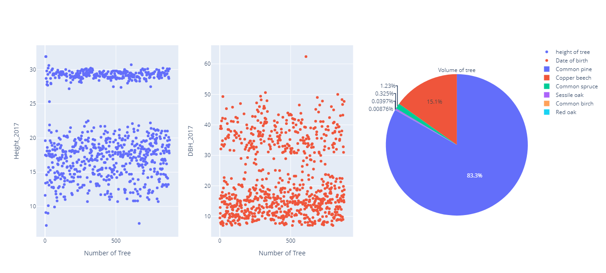

# Project Overview

This project aims to create a Python-based tool for plotting hierarchical data stored in CSV format The tool will read the CSV file,
interpret the hierarchical relationships, and generate a tree plot to visualize the data. This README file provides an overview of the project and instructions for setting it up and using it.
convert umt to lat long for displaying in map
## csv File
 TreeNo,X,Y,TreeName,DBH_2017,Height_2017,BA_2017,Volume_2017,Quadrant_2017
 
 ## Display 
 
 

## Features
 Read hierarchical data from a CSV file.
 convert umt to lat long
 save lat long in csv file
 Generate a tree plot to visualize the hierarchical structure.
 Customize the appearance of the tree plot (colors, labels, etc.).
 Export the tree plot to various image formats (PNG, JPG, SVG, etc.)

 
 
## Getting Started
Follow these steps to set up and run the project on your local machine:

## Prerequisites
 Make sure you have the following prerequisites installed:

 Python 3.x
 https://plotly.com/python/scattermapbox/
 https://pypi.org/project/pyproj/


## Graph
 


 
 ```bash
  ## Clone the Repository

  Open your terminal or command prompt.
  Navigate to the directory where you want to clone the project.
  Run the following command to clone the repository:

  git clone https://github.com/Princeroy1/csv-Tree-ploting-Project

  pip install -r requirements.txt

  pip install django

  pip install pyproj

  pip install scattermapbox

  pip install plotly


## Contact

 https://github.com/Princeroy1/csv-Tree-ploting-Project, Abdul Rouf, and abdulrouf8010@gmail.com

 
 
